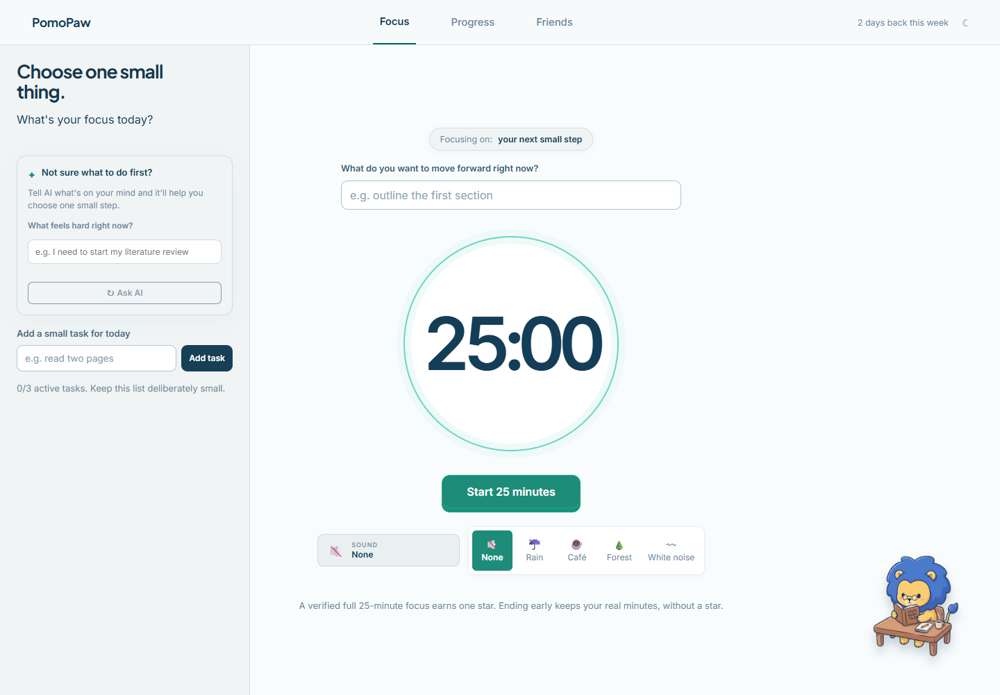
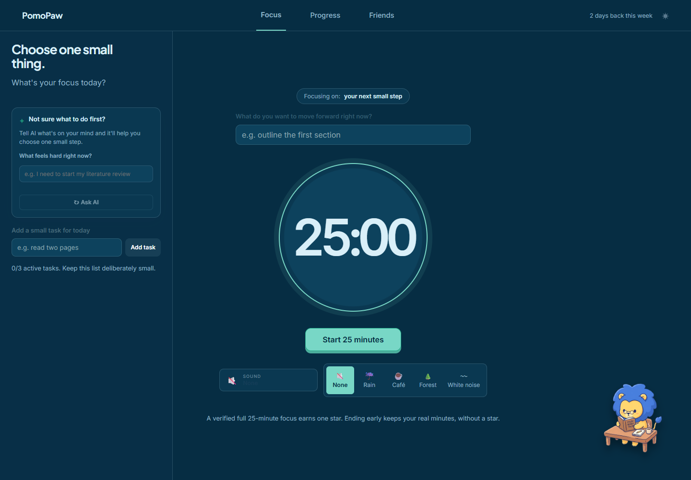
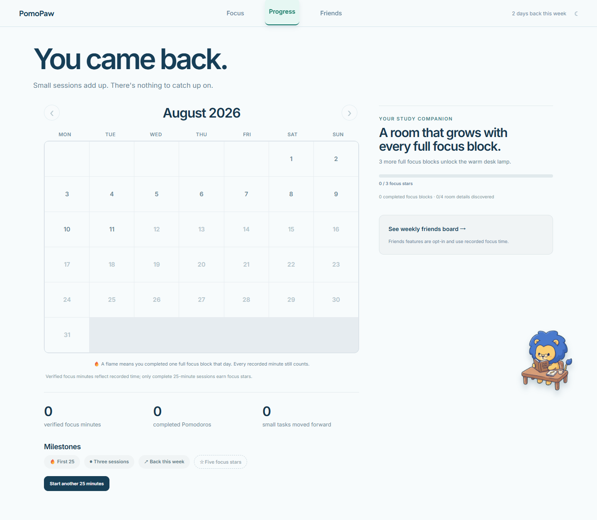
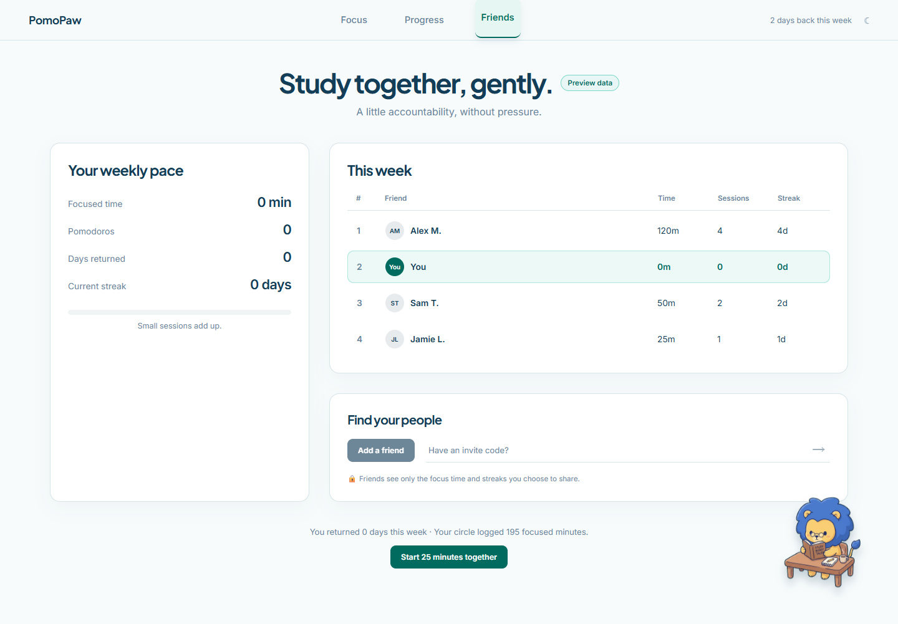
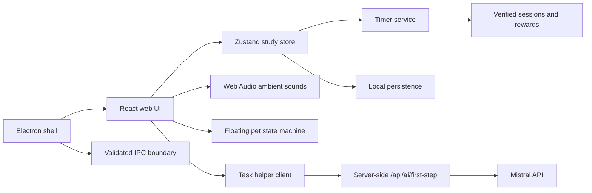

# PomoPaw

> An ADHD-friendly Pomodoro focus timer with a virtual pet, task-breakdown AI, ambient sound, streaks, and gentle gamification.

[](https://github.com/mcwch/pomopaw-adhd-pomodoro-focus-pet/actions/workflows/ci.yml)
[](LICENSE)
[](https://focus-companion-indol.vercel.app)

PomoPaw is a local-first focus companion for people who want a dependable Pomodoro timer without turning productivity into pressure. A blue-maned lion studies alongside you, reacts to focus state, and makes progress visible through a warm study corner, daily calendar, stars, and gentle social previews.

The visual direction was prototyped with Stitch and then refined into the React/Electron implementation. This repository documents the product and implementation, not private design prompts or internal planning materials.

## Try it

- **Web demo:** [focus-companion-indol.vercel.app](https://focus-companion-indol.vercel.app)
- **Desktop target:** Windows first, with Electron build scripts for macOS and Linux

The hosted demo currently keeps Friends data as clearly labelled preview data. Accounts, cloud sync, and real friend rankings are planned for a later milestone.

## Product highlights

- **Reliable Pomodoro core:** 25-minute focus, 5-minute short break, and 15-minute long break phases. Pausing and recovery are explicit; ending early records real minutes but does not award a focus star.
- **ADHD-friendly task rail:** keep today deliberately small (up to three active tasks), choose one next step, and avoid a blank-screen decision.
- **Task-breakdown AI:** describe what feels hard and ask Mistral for one concrete first action. The key stays server-side; PomoPaw remains useful when AI is unavailable.
- **Ambient sound:** None, Rain, Café, Forest, and White noise, with no audio required.
- **Companion states:** the lion idles, studies, blinks, stretches, walks while dragged, rests during breaks, and celebrates verified completion.
- **Progress that feels tangible:** a real monthly calendar, flame return markers, focus stars, milestones, and a study-corner scene that unlocks details.
- **Gentle social motivation:** Friends is a privacy-forward visual preview of weekly focused minutes, sessions, and streaks. It is intentionally opt-in and not a pressure leaderboard yet.
- **Light and dark mode:** theme preference is stored locally in the browser/desktop profile.
- **Local-first storage:** timer recovery, tasks, history, rewards, and theme work without an account.

## Screenshots

### Focus desk

| Light | Dark |
| --- | --- |
|  |  |

### Progress and Friends

| Progress | Friends preview |
| --- | --- |
|  |  |

## How the experience works

1. Add one small task, or ask AI to shrink a difficult task into a first action.
2. Choose an ambient sound and start a 25-minute focus block.
3. The pet changes to its study state while the timer runs. Pause/resume is explicit, and ending early preserves verified minutes without a star.
4. A completed focus block awards a star, records the day, updates streak/milestone state, and triggers a celebration.
5. Breaks switch the pet to rest. Progress and Friends make the next return feel visible without requiring an account.

## Architecture



See [the architecture guide](docs/architecture.md) for runtime boundaries, timer invariants, storage, deployment, and the path from preview data to accounts/cloud sync.

## Tech stack

- React 19 + TypeScript
- Vite for the web build
- Electron 39 + electron-vite for the desktop shell
- Zustand for state management
- Vitest + Testing Library + Playwright for tests and visual QA
- Vercel static hosting for the web demo
- Mistral API through a server-side proxy for optional task help

### Data layer

PomoPaw **does not use a remote database yet**. The current release is intentionally local-first:

- Web: browser-local persistence for tasks, timer recovery, history, rewards, and theme.
- Desktop: local application persistence behind the Electron main/preload boundary.
- Friends: clearly labelled mock/preview data; no account or social data is stored.

When accounts and cloud sync are added, the planned boundary is an authenticated API backed by a durable database (the specific provider is intentionally not chosen yet). Offline timer use will remain independent of that service.

## Repository layout

```text
src/
  main/       Electron main process, timer and tray lifecycle
  preload/    Typed renderer bridge
  renderer/   Desktop React surface
  shared/     IPC schemas and shared domain types
  server/     Mistral proxy and provider client
  web/        Vite web app, pages, pet, sounds, storage and styles
tests/        Unit, renderer, web and integration coverage
docs/         Product, architecture, QA, screenshots and asset policy
.github/      CI, issue forms and contribution templates
```

## Local development

Requirements: Node.js 22+, npm, and (for the desktop app) a Windows/macOS/Linux environment supported by Electron.

```bash
npm install

# Web app at http://localhost:4177
npm run dev:web

# Electron desktop app
npm run dev
```

Useful checks:

```bash
npm run typecheck
npm test -- --run
npm run build:web
npm run build:win       # Windows installer/unpacked build
npm run build:mac       # macOS build
npm run build:linux     # Linux build
```

## Optional AI configuration

The task helper reads `ADHD_APP_MISTRAL_API_KEY` only on the server side. Never expose it with a `VITE_` prefix, commit it, or paste it into browser code.

PowerShell:

```powershell
[Environment]::SetEnvironmentVariable("ADHD_APP_MISTRAL_API_KEY", "your-key", "User")
```

Restart the dev server after changing the variable. Mistral Free mode has rate and usage limits; the UI explains when the helper is unavailable and the rest of PomoPaw continues to work.

### Mistral configuration

The hosted task helper uses a server-side Mistral chat-completions request with these intentionally conservative settings:

| Setting | Value | Purpose |
| --- | --- | --- |
| Model | `mistral-small-latest` | Low-latency, cost-conscious task help |
| Temperature | `0.45` | Some variation without making first steps erratic |
| Max output tokens | `80` | Keeps the response short and focused |
| Streaming | Disabled | The UI shows one complete first-step suggestion |
| Request boundary | `POST /api/ai/first-step` | Keeps the API key out of browser code |

Each request is stateless: PomoPaw does not store prompts, responses, or personal task history.

## Deployment

The web build is configured for Vercel in [`vercel.json`](vercel.json). The production demo is currently deployed at [focus-companion-indol.vercel.app](https://focus-companion-indol.vercel.app). The hosted `/api/ai/first-step` Function reads `ADHD_APP_MISTRAL_API_KEY` from Vercel’s server-side production environment; the key is never bundled into the browser.

## Roadmap

- [x] Reliable local-first Pomodoro and recovery behavior
- [x] ADHD-friendly task rail and optional Mistral first-step helper
- [x] Pet states, ambient sound, calendar progress, stars, and study-corner unlocks
- [x] Friends visual preview with privacy-first copy
- [ ] Real accounts, cloud sync, and opt-in friends leaderboard
- [ ] Curated pet/decor unlock catalog and richer desktop notifications
- [ ] Installable signed releases and automated Vercel/GitHub deployment previews

## Contributing

Bug reports, design feedback, accessibility notes, and small improvements are welcome. Please read [CONTRIBUTING.md](CONTRIBUTING.md), follow the [Code of Conduct](CODE_OF_CONDUCT.md), and include reproduction steps for behavior changes.

## Security and privacy

PomoPaw is designed to keep focus history local until cloud features are deliberately added. Please report security issues privately using [SECURITY.md](SECURITY.md), and never open an issue containing API keys, tokens, or private personal data.

## License and visual assets

Source code is released under the [MIT License](LICENSE). The lion artwork, study-corner illustrations, Stitch exports, and other visual assets are documented separately in [docs/ASSETS_LICENSE.md](docs/ASSETS_LICENSE.md); do not assume that the code license grants reuse rights for every image.
