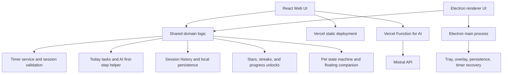

# PomoPaw Public GitHub Release Design

## Goal

Prepare the PomoPaw repository for a professional public GitHub release. The repository should be understandable to two audiences at once:

1. People evaluating an ADHD-friendly productivity tool should understand the product, see the experience, and launch it quickly.
2. Developers evaluating the project should understand the architecture, technology choices, data flow, testing strategy, security boundaries, and contribution path.

The public repository name will be `pomopaw-adhd-pomodoro-focus-pet` and the product brand will be **PomoPaw**.

## Product positioning

PomoPaw is an ADHD-friendly Pomodoro focus timer with a virtual study pet, task-breakdown AI, ambient sound, streaks, and gentle gamification.

Primary searchable concepts:

- ADHD productivity tool
- Pomodoro focus timer
- virtual pet focus companion
- React and TypeScript productivity app
- Electron desktop app
- Vite web app
- Mistral AI task breakdown
- white noise and ambient sound
- streaks and focus gamification

The README will use the product tagline:

> An ADHD-friendly Pomodoro focus timer with a virtual pet, task-breakdown AI, ambient sound, streaks, and gentle gamification.

## Documentation architecture

### Root README

The README is the first-use document and stays focused on essential information:

1. Brand, tagline, badges, online demo, and quick links.
2. Product screenshots for Focus, Progress, Friends, dark mode, and the floating pet.
3. What PomoPaw does and why it exists.
4. Feature overview and the ADHD-friendly design principles.
5. A compact architecture diagram.
6. Technology stack and platform support.
7. Quick start for web development and desktop development.
8. Test, build, and deployment commands.
9. Environment variables and security notes.
10. Current implementation status and roadmap.
11. Contributing, security reporting, and license links.

Longer technical material belongs in `docs/` rather than making the README unnecessarily large.

### Technical documentation

Create or maintain the following documents:

- `docs/architecture.md`: runtime boundaries, shared domain logic, timer state machine, persistence, AI request flow, and deployment topology.
- `docs/product-overview.md`: product principles, user flow, reward rules, pet state mapping, and current mock-data boundaries.
- `docs/screenshots/`: curated screenshots captured from the verified web build.
- `docs/manual-qa-reliable-timer.md`: existing manual QA checklist for timer reliability.

### Repository collaboration files

Add:

- `CONTRIBUTING.md`: local setup, branch/commit expectations, validation commands, and UI review guidance.
- `SECURITY.md`: secret-handling rules and vulnerability reporting path.
- `CODE_OF_CONDUCT.md`: contributor expectations.
- `LICENSE`: an open-source license selected before publication; MIT is the recommended default for this personal project.
- `.github/workflows/ci.yml`: install dependencies, typecheck, run tests, and build the web app on pushes and pull requests.
- `.github/ISSUE_TEMPLATE/bug_report.md` and `feature_request.md`.
- `.github/pull_request_template.md`.

## Architecture narrative

The README and architecture document will describe the application as three layers:

The architecture explanation must distinguish current behavior from planned behavior:

- The timer, tasks, history, rewards, sound selection, and pet state are local-first.
- The Friends page currently combines real local user metrics with clearly labelled mock friend rows.
- Account, cloud sync, real friend relationships, and production AI serverless routing remain roadmap items.
- The Vercel-hosted web app currently serves the built React client. The Mistral proxy must be moved into a Vercel Function and configured with a server-side environment variable before AI works in production.

## Feature documentation

Document the following as user-visible behavior:

- Reliable 25-minute focus, 5-minute short break, and 15-minute long break defaults.
- Pause/resume and end-early behavior. Ending early keeps the measured minutes but does not award a full-session star.
- Deliberately small task list with a maximum of three active tasks.
- AI helper that asks what feels hard and proposes one small first step.
- Sound choices: None, Rain, Café, Forest, and White noise.
- Pet action mapping: idle, study, blink, stretch, walk while dragged, rest during breaks, and celebrate after completion.
- Progress calendar, verified focus history, stars, and study-corner unlocks.
- Friends preview board, weekly pace metrics, invite-code surface, and the future account/cloud-sync boundary.
- Dark mode, responsive web layout, and the Vercel demo link.

## Public repository hygiene

Never publish:

- `.env.local`, API keys, OAuth tokens, or deployment credentials.
- `.vercel/`, `node_modules/`, build outputs, or local caches.
- Temporary Stitch API response files and uncurated generated artifacts.

Keep only curated design prompts or exported assets that are useful for understanding the product. Screenshots should be captured from the verified app and stored under `docs/screenshots/` with stable relative links.

## Validation and release gates

Before creating the public repository:

1. Run the full test suite.
2. Run TypeScript typechecking.
3. Build the web application.
4. Verify Focus, Progress, Friends, dark mode, and the pet in a browser.
5. Inspect the staged file list for secrets, generated output, and unrelated worktree files.
6. Confirm README image links render from the repository root.
7. Create the public repository with the final description and searchable topics.
8. Push the curated branch and verify the GitHub landing page.

## Release metadata

Recommended repository description:

> ADHD-friendly Pomodoro focus timer with a virtual pet, task-breakdown AI, ambient sound, streaks, and gentle gamification. Built with React, TypeScript, Vite, and Electron.

Recommended repository topics:

`adhd`, `pomodoro`, `focus-timer`, `virtual-pet`, `productivity`, `react`, `typescript`, `electron`, `vite`, `mistral-ai`, `white-noise`, `gamification`, `desktop-app`
